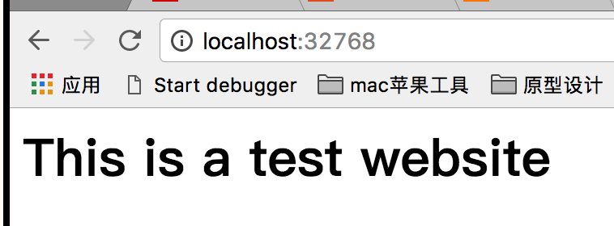
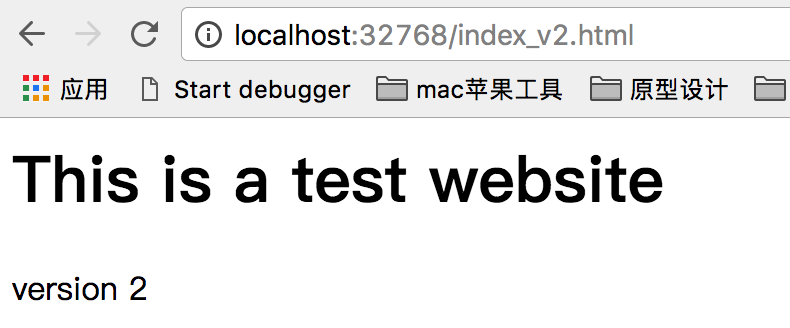

# 用Docker自动生成一个nginx的网站部署

## 目录结构

|
|-- Dockerfile Docker 配置文件
|
|-- <nginx> nginx 配置目录
|
|-- <site>  静态网站内容


## 执行方法

* 安装Docker
* Clone工程
```
  git clone https://github.com/acharzuo/docker_deploy.git
```
* 执行
```
  cd docker_deploy/nginx_static_website
  docker build -t "achar/nginx" .
  docker run -d -p 80 --name website -v $PWD/website:/var/www/html/website achar/nginx nginx
```
注意：docker build 命令后面有一个代表当前目录的`点*.*`
* 寻找映射到本地的端口号
```
  docker ps
```
  返回
```
CONTAINER ID        IMAGE               COMMAND             CREATED             STATUS              PORTS                   NAMES
28b94330272e        achar/nginx         "nginx"             2 minutes ago       Up 2 minutes        0.0.0.0:32768->80/tcp   website
```
其中`0.0.0.0:32768->80/tcp` 就是将本地的32768端口映射为docker镜像的80端口
* 访问网站
[http://localhost:32768](http://localhost:32768)


* 更新网站
直接修改本地目录下的website中的文件即可
[http://localhost:32768/index_v2.html](http://localhost:32768/index_v2.html)

## 常见问题

### Cannot connect to the Docker daemon at unix:///var/run/docker.sock. Is the docker daemon running?
Docker服务器没有启动。

## docker: Error response from daemon: Conflict. The container name "/website" is already in use by container 9e5ecfdfe8b0bf3350bd833a6aef8a21ac054db09de945723cffde299dd91f53. You have to remove (or rename) that container to be able to reuse that name..
See 'docker run --help'.

以website命名的镜像已经存在，可以 删除已经有的docker容器，或者将即将运行的docker容器改一个名字
```
docker rm website    # 删除重名的容器
```
